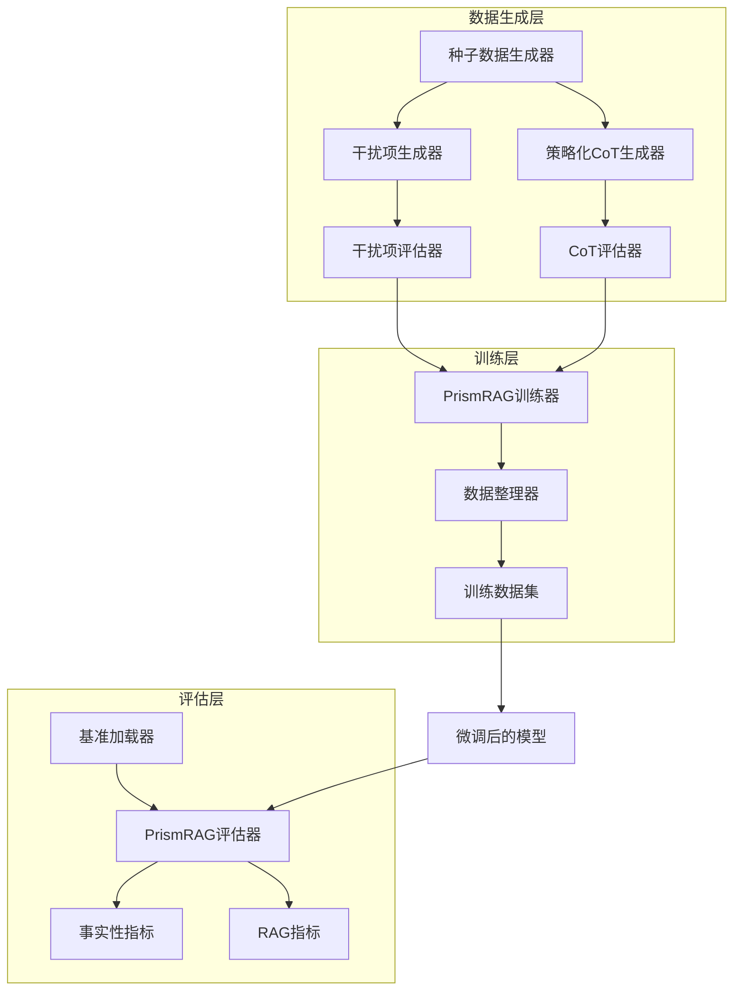
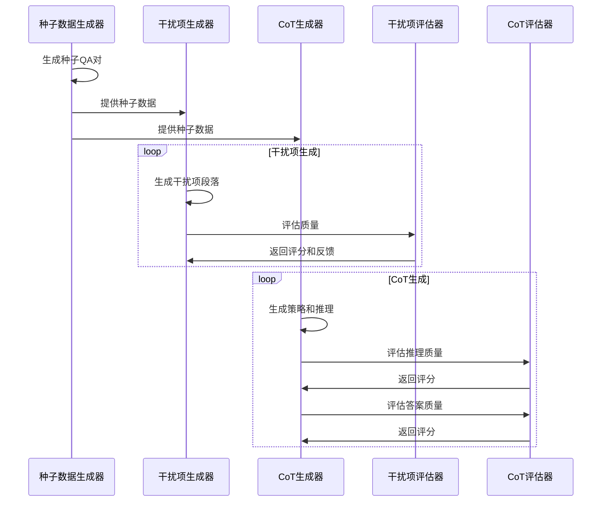
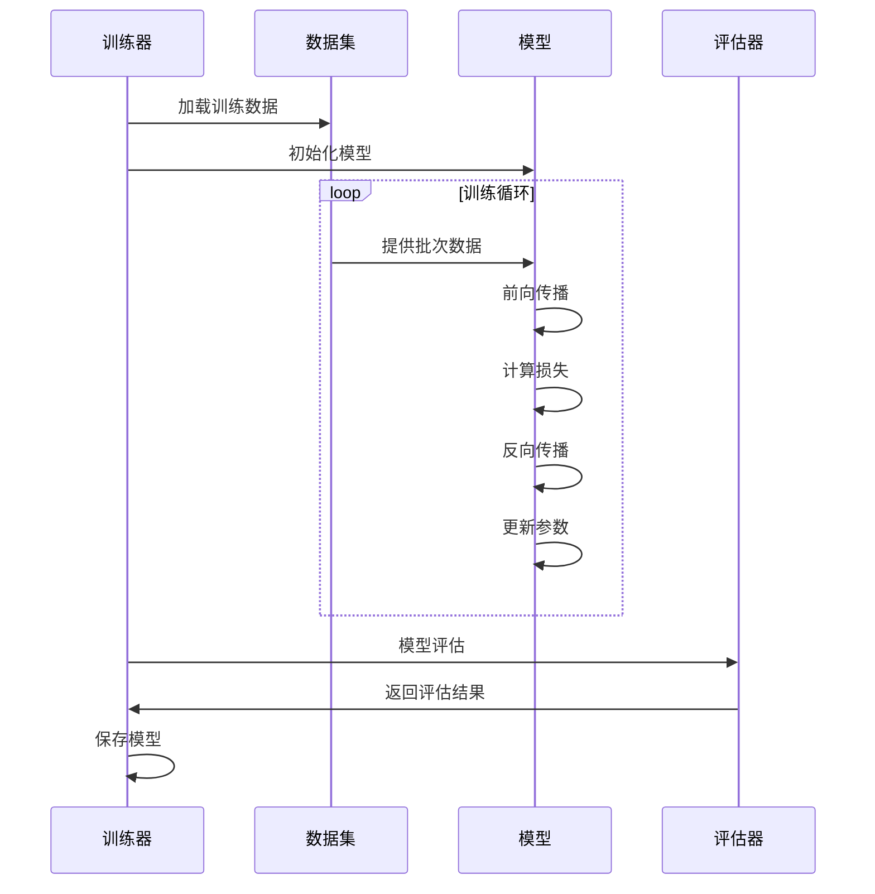

# PrismRAG 设计文档

## 1. 项目概述

PrismRAG 是基于 Meta AI 研究论文的实现，旨在通过两个核心机制提升检索增强生成(RAG)的事实性：

1. **干扰项抵抗力 (Distractor Resilience)**: 通过合成干扰项训练提升模型对检索噪声的鲁棒性
2. **策略化思维链 (Strategic CoT)**: 通过动态策略生成提升模型的推理能力

## 2. 系统架构



## 3. 核心组件设计

### 3.1 数据生成模块

#### 种子数据生成器 (SeedDataGenerator)
- **功能**: 从原始文档生成问答对
- **输入**: 维基百科页面、网页搜索结果
- **输出**: 问题-答案-段落三元组
- **关键技术**: 逆向问题生成，基于LLM的QA对生成

#### 干扰项生成器 (DistractorGenerator)
- **功能**: 生成合成干扰项段落
- **核心流程**:
  1. 识别黄金段落中的关键实体、位置、时间
  2. 重新表述问题为开放式形式
  3. 系统性修改关键信息生成干扰项
  4. 质量评估和迭代优化
- **质量控制**: 基于相关性、迷惑性、格式相似性的多维评估

#### 策略化CoT生成器 (StrategicCoTGenerator)
- **功能**: 生成动态推理策略和思维链
- **核心流程**:
  1. 生成高层推理策略大纲
  2. 基于策略生成详细CoT推理
  3. 评估推理质量和答案正确性
  4. 迭代优化直到达到质量标准
- **创新点**: 教会模型"如何思考"而非"思考什么"

### 3.2 训练模块

#### PrismRAG训练器 (PrismRAGTrainer)
- **功能**: 统一的模型微调框架
- **支持特性**:
  - LoRA参数高效微调
  - 混合训练数据处理
  - 分布式训练支持
  - W&B实验跟踪
- **训练策略**: 在助手回复上计算损失，指令部分被掩码

#### 数据集类 (PrismRAGDataset)
- **功能**: 处理训练数据的标记化和格式化
- **特点**:
  - 支持指令微调格式
  - 自动处理填充和截断
  - 标签掩码处理

### 3.3 评估模块

#### PrismRAG评估器 (PrismRAGEvaluator)
- **功能**: 全面的模型评估框架
- **评估维度**:
  - 多基准测试评估
  - 鲁棒性分析
  - 事实性评分
- **支持特性**:
  - vLLM加速推理
  - 批量处理
  - 详细结果分析

#### 事实性指标 (FactualityMetrics)
- **功能**: 实现论文中的事实性评估方法
- **分类标准**:
  - Accurate: 完全准确的回答
  - Hallucination: 包含错误信息的回答
  - Missing: 拒绝回答或不完整的回答
- **评分公式**: Factuality Score = Accuracy - Hallucination Rate

## 4. 数据流设计

### 4.1 训练数据生成流程



### 4.2 模型训练流程



## 5. 关键技术实现

### 5.1 干扰项生成算法

```python
def generate_distractor(self, question, answer, passage):
    for iteration in range(max_iterations):
        # 1. 识别关键实体
        entities = extract_key_entities(passage, question, answer)
        
        # 2. 生成开放式问题
        open_question = reformulate_question(question)
        
        # 3. 修改实体生成干扰项
        distractor = modify_entities(passage, entities)
        
        # 4. 评估质量
        score = evaluate_distractor(question, answer, passage, distractor)
        
        if score >= quality_threshold:
            return distractor
    
    return None
```

### 5.2 策略化CoT生成算法

```python
def generate_strategic_cot(self, question, references, ground_truth):
    for iteration in range(max_iterations):
        if iteration < random_attempts:
            # 随机生成
            cot_data = generate_cot_random(question, references)
        else:
            # 基于批评的修订
            cot_data = generate_cot_with_critique(question, references, critique)
        
        # 评估推理质量
        reasoning_score = evaluate_reasoning(cot_data)
        answer_score = evaluate_answer(cot_data, ground_truth)
        
        if reasoning_score >= threshold and answer_score >= threshold:
            return cot_data
    
    return None
```

### 5.3 事实性评估算法

```python
def categorize_response(self, question, ground_truth, response, references):
    # 1. 检查是否为拒绝回答
    if is_missing_response(response):
        return "missing"
    
    # 2. 使用LLM评估事实性
    factuality_score = evaluate_factuality_with_llm(
        question, ground_truth, response, references
    )
    
    # 3. 基于评分分类
    if factuality_score >= 3.5:
        return "accurate"
    elif factuality_score <= 2.0:
        return "hallucination"
    else:
        return resolve_borderline_case(question, ground_truth, response)
```

## 6. 性能优化策略

### 6.1 计算优化
- **LoRA微调**: 减少可训练参数，降低内存需求
- **梯度检查点**: 减少训练时的内存占用
- **混合精度训练**: 使用FP16加速训练
- **vLLM推理**: 加速评估阶段的推理

### 6.2 数据优化
- **批量处理**: 提高数据生成和评估效率
- **缓存机制**: 避免重复计算
- **数据流水线**: 并行处理数据生成和训练

### 6.3 质量控制
- **迭代生成**: 多轮生成和评估确保质量
- **阈值控制**: 设置质量阈值过滤低质量样本
- **人工抽检**: 定期人工验证生成质量

## 7. 扩展性设计

### 7.1 模块化架构
- 各组件独立设计，便于单独测试和优化
- 标准化接口，支持不同模型和数据源
- 插件式架构，便于添加新的评估指标

### 7.2 配置驱动
- YAML配置文件管理所有超参数
- 支持不同实验配置的快速切换
- 环境变量支持，便于部署

### 7.3 监控和日志
- 详细的训练和评估日志
- W&B集成，实时监控实验进展
- 错误处理和恢复机制

## 8. 未来改进方向

### 8.1 算法改进
- 更复杂的干扰项生成策略
- 强化学习优化数据生成过程
- 多模态RAG支持

### 8.2 工程优化
- 分布式训练支持
- 模型量化和压缩
- 在线学习和增量更新

### 8.3 评估扩展
- 更多基准测试支持
- 多语言评估
- 领域特定评估指标